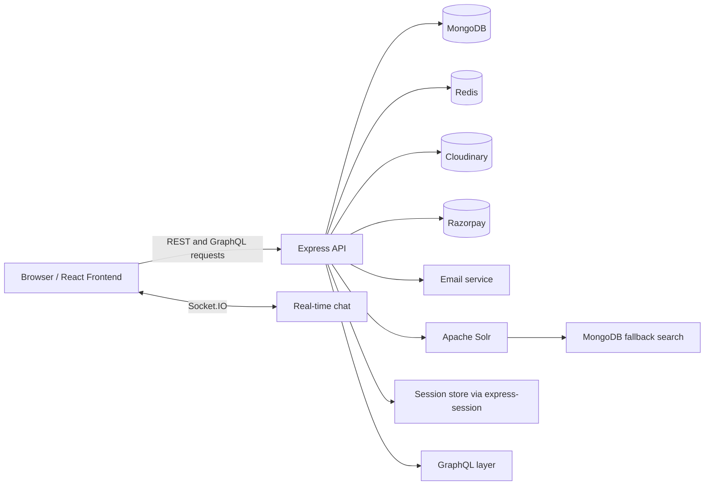

# Milestone Freelancing Platform

Milestone is a full-stack freelancing marketplace for employers, freelancers, moderators, and platform administrators. The application combines a REST API, GraphQL endpoints, real-time chat, payments, file uploads, search indexing, and role-based dashboards across a React frontend and an Express/MongoDB backend.

## Overview

The platform supports the complete freelance workflow:

1. Users sign up and authenticate with session-based login.
2. Employers create jobs, review applications, purchase subscriptions, and manage work and payments.
3. Freelancers maintain profiles, submit applications, take quizzes to earn skill badge, track jobs, and view earnings.
4. Moderators review jobs, users, complaints, quizzes, and blogs.
5. Admins oversee platform metrics, users, moderators, revenue, ratings, and operational controls.

The backend exposes both REST and GraphQL interfaces. REST handles most application actions, while GraphQL is used for targeted data retrieval, especially around chat and employer workflows. Search is backed by Apache Solr with a MongoDB fallback when Solr is unavailable. Real-time messaging is handled with Socket.IO and session-aware authentication.

## Tech Stack

### Frontend

- React 19
- Vite
- React Router
- Redux Toolkit and Redux Persist
- Tailwind CSS
- Axios and native fetch
- Socket.IO client
- Leaflet and React Leaflet
- Recharts
- Formik and Yup
- Vitest and Testing Library

### Backend

- Node.js
- Express 5
- MongoDB with Mongoose
- GraphQL with graphql-http and @graphql-tools/schema
- Socket.IO
- express-session
- Redis for caching and benchmark support
- Apache Solr for search and indexing
- Cloudinary for image and PDF uploads
- Razorpay for payments
- Nodemailer for email flows
- Swagger for API documentation
- Jest and Supertest

### Deployment and Tooling

- Docker and Docker Compose
- Nginx for frontend serving in production containers
- Morgan logging with rotating access logs
- Helmet, CORS, HPP, and Mongo sanitization for API hardening

## Features

### Authentication and Accounts

- Email-based OTP signup flow
- Session-based login and logout
- Password reset with OTP verification
- Role-aware access control

### Employer Features

- Create, update, delete, and boost job listings
- Review and accept or reject applications
- View transaction details and payment history
- Purchase employer subscriptions
- Manage company details and profile data
- Use chat and notifications for active projects

### Freelancer Features

- Public profile and profile editing
- Resume, portfolio image, and profile picture uploads
- Apply to jobs and track job history
- View active jobs and payment details
- Purchase or upgrade subscriptions
- Take quizzes and view quiz results
- Collect skills badges and receive notifications

### Moderator Features

- Review jobs, employers, freelancers, and approvals
- Manage complaints and resolutions
- Create, edit, and publish blogs
- Create and manage quizzes
- Maintain moderator profile data

### Admin Features

- Platform dashboard and revenue analytics
- User, freelancer, employer, and moderator management
- Complaint oversight and rating adjustment controls
- Payment and system activity views
- Admin profile management

### Platform Capabilities

- Real-time chat with Socket.IO
- Search and suggestions powered by Solr
- Automatic Solr synchronization on data changes
- Redis-backed caching for selected endpoints
- Swagger API documentation
- Dockerized local development and deployment

## Architecture Flow



Request flow in practice:

1. The frontend reads the backend URL from Vite environment variables.
2. Most actions call REST endpoints under `/api/*`.
3. GraphQL requests go to `/graphql` for targeted data reads.
4. Authentication uses session cookies shared across REST, GraphQL, and Socket.IO.
5. Job and blog changes are indexed into Solr and invalidated through cache hooks.
6. Media uploads are stored in Cloudinary or local upload storage depending on the route.

## Roles

### Employer

Employers post work, manage applicants, handle subscriptions, review project progress, and communicate with freelancers.

### Freelancer

Freelancers build profiles, apply for jobs, track assignments, manage payments, and participate in quizzes and badge workflows.

### Moderator

Moderators curate content and platform quality by reviewing jobs, users, complaints, blogs, and quizzes.

### Admin

Admins manage the overall platform, including users, role accounts, revenue, moderation controls, and rating adjustments.

## Build and Run

### Local Development

Backend:

```bash
cd Milestone-backend
npm install
npm run dev
```

Frontend:

```bash
cd Milestone-frontend
npm install
npm run dev
```

Default local ports:

- Backend: `http://localhost:9000`
- Frontend: `http://localhost:3000`

### Docker Compose

Run the full stack with MongoDB, backend, and frontend containers:

```bash
cd Milestone-backend
docker compose up -d --build
```

Useful checks:

```bash
docker compose ps
curl http://localhost:9000/api/health
```

Shutdown:

```bash
docker compose down
```

### Tests

Backend:

```bash
cd Milestone-backend
npm test
```

Frontend:

```bash
cd Milestone-frontend
npm test
```

## Environment Variables

Create a backend `.env` file in `Milestone-backend` and a frontend `.env` file in `Milestone-frontend` when running locally.

### Backend `.env`

```bash
NODE_ENV=development
PORT=9000
FRONTEND_ORIGIN=http://localhost:3000
FRONTEND_ORIGINS=http://localhost:3000,http://localhost:5173
SESSION_SECRET=replace_me
MONGO_URL=mongodb://127.0.0.1:27017/milestone
REDIS_URL=redis://localhost:6379
SOLR_BASE_URL=http://localhost:8983/solr
SOLR_CORE_JOBS=jobs
SOLR_CORE_BLOGS=blogs
EMAIL_SERVICE=gmail
EMAIL_USER=your-email@example.com
EMAIL_PASS=your-app-password
CLOUDINARY_CLOUD_NAME=your_cloud_name
CLOUDINARY_API_KEY=your_api_key
CLOUDINARY_API_SECRET=your_api_secret
RAZORPAY_KEY_ID=your_razorpay_key_id
RAZORPAY_KEY_SECRET=your_razorpay_key_secret
```

### Frontend `.env`

```bash
PORT=3000
VITE_BACKEND_URL=http://localhost:9000
VITE_GRAPHQL_URL=http://localhost:9000/graphql
VITE_RAZORPAY_KEY_ID=your_razorpay_key_id
```

## API Surface

### REST

The backend exposes REST endpoints for:

- Authentication and account recovery
- Employer workflows
- Freelancer workflows
- Moderator workflows
- Admin workflows
- Blogs and content management
- Questions and quizzes
- Notifications
- Chat
- Payments
- Search and reindexing

### GraphQL

GraphQL is available at `/graphql` and is used for focused data retrieval around:

- Chat conversations and message history
- Employer application summaries and details
- Employer transaction details
- Supporting profile and match data for application review

### Documentation

Swagger UI is served by the backend at `/api-docs`.

## Repository Structure

```text
README.md
Milestone-backend/
	config/
	controllers/
	graphql/
	middleware/
	models/
	newSeed/
	routes/
	scripts/
	seeds/
	services/
	solr/
	test/
	uploads/
	utils/
	Dockerfile
	docker-compose.yml
	index.js
	package.json
Milestone-frontend/
	public/
	scripts/
	src/
	test/
	Dockerfile
	vite.config.js
	vitest.config.js
	package.json
```

## Runtime Notes

- Sessions are cookie-based and shared with Socket.IO.
- CORS is restricted through configured frontend origins.
- Uploaded files are either served from local storage or handled via Cloudinary depending on the route.
- Search requests fall back to MongoDB text search if Solr is not reachable.
- Access logs are written with rotating file streams under the backend logs directory.

## Security Controls

- Helmet headers are enabled.
- MongoDB operator injection is sanitized from request bodies and params.
- HPP is applied outside the GraphQL route.
- Rate limiting is applied to sensitive authentication and upload flows.
- Production cookies are configured for secure cross-site usage.